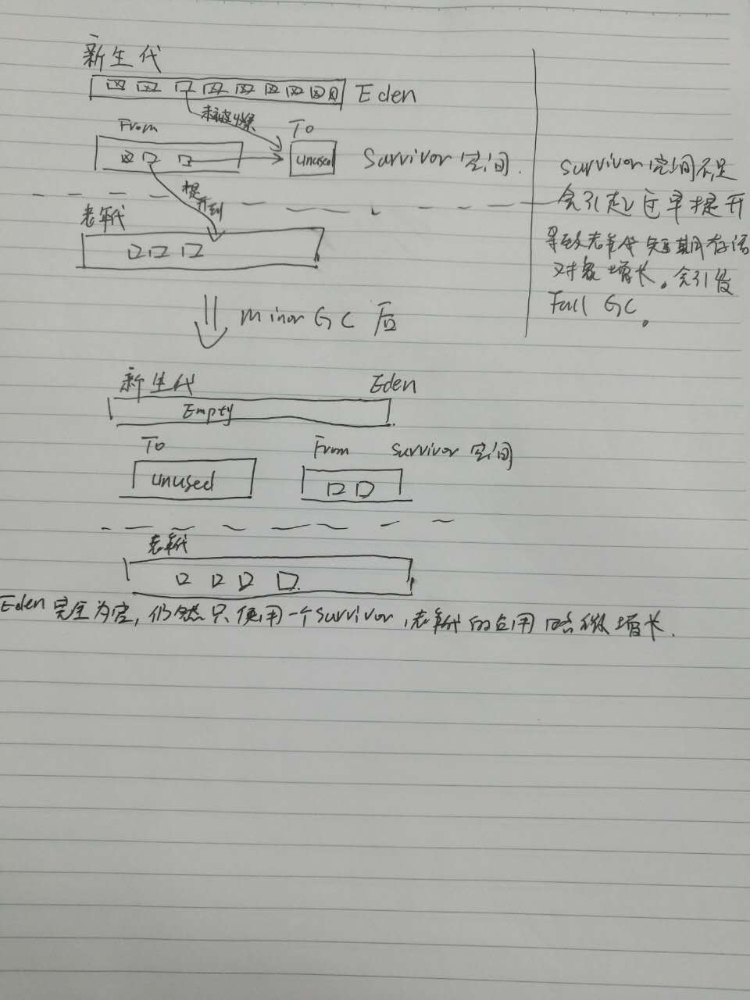
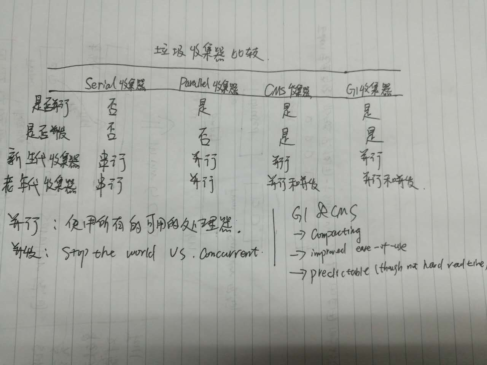

# Jave read and practice

# Maven
生成简单的工程：

```
mvn archetype:generate -DgroupId=com.mycompany.helloworld -DartifactId=helloworld -Dpackage=com.mycompany.helloworld -Dversion=1.0-SNAPSHOT
```
man package 打包

 运行：
 ```
 java -cp target/helloworld-1.0-SNAPSHOT.jar com.mycompany.helloworld.App
 ```

可以看到运行时的全部POM内容：
```
mvn help:effective-pom
```

POM 中，groupId, artifactId, packaging, version 叫作 maven 坐标，它能唯一的确定一个项目。maven 插件；maven生命周期，mvn package 生命周期的一个阶段，执行直到package 结束。

1.process-resources 阶段：resources:resources compile 阶段：compiler:compile process-classes 阶段：(默认无目标) process-test-resources 阶段：resources:testResources test-compile 阶段：compiler:testCompile test 阶段：surefire:test prepare-package 阶段：(默认无目标) package 阶段：jar:jar
Maven 依赖管理 自动下载所需依赖到本地库；

2.mvn install. 会将包安装到本地库:~/.m2/repository

# Gradle
整体上Gradle比Maven更加面向程序员，因为可以通过代码来创建build流程，实现依赖关系的精确控制。使用起来也很方便，不会感到很繁琐，也能良好的兼容maven工程。

Gradle的网络proxy设置，这是在使用中遇到的，因为公司网络要走proxy：

```
systemProp.http.proxyHost=proxy_host
systemProp.http.proxyPort=proxy_port
systemProp.http.proxyUser=global/I311352
systemProp.http.proxyPassword=password

systemProp.https.proxyHost=proxy_host
systemProp.https.proxyPort=proxy_port
systemProp.https.proxyUser=global/I311352
systemProp.https.proxyPassword=password
```

另外就是很多开源的Java框架或者库之类的基本都是用Gradle，例如Spring，ElasticSearch等等。Gradle也能跟IntelliJ IDEA很好的结合起来。总之Gradle会越来越受欢迎。

# IDE
[IntelliJ IDEA](https://www.jetbrains.com/idea/download/#section=windows) community版，总体上比eclipse好用。


# BOOKS
### [Thinking in Java](http://compasses.github.io/2016/07/26/book-review-thinking-in-java/)

## Java 并发编程系列

### 并发基础：
1. 绝大多数时间，所有的线程都应该以默认的优先级运行。试图操纵优先级通常是一种错误。
2. Thread 类自身不执行任何操作，它只是驱动赋予它的任务。
3. 共享资源一般是以对象形式存在的内存片段，但也可以是文件、输入、输出端口。
4. 可视性问题远比原子性问题多得多。理解原子性和易变性不是相同的概念很重要。非volatile域上的原子操作不必刷新到主存中，因此其他看到该域的任务不必是最新的值。如果多个任务在同时访问某个域，那么这个域应该是volatile的，否则这个域应该经由同步来访问。同步也会导致向主存中刷新。因此如果一个域完全由synchronized方法或语句块来保护，那就不必要将其设置为volatile。
5. 使用volatile而不是synchronized的唯一安全的情况是类中只有一个可变的域。
6. I/O 具有锁住你的多线程程序的潜在可能。nio能够支持让阻塞的NIO通道会自动地响应中断。
7. 同一个互斥操作可以被同一个任务多次获得。Java SE5并发类库中的ReentrantLock上阻塞的任务具备可以被中断的能力。
8. 线程间协作，wait，notify，notifyAll是object 的一部分而不是Thread的。
9. while 惯用法：
  ```
  while (conditionIsNotMet)
    wait();
  ```
  可以保证你退出循环之前，条件将得到满足。

### 并发编程实践
1. 加锁机制既可以确保可见性又可以确保原子性，而volatile变量只能确保可见性。
2. 避免不成熟的优化。首先使程序运行正确，然后提高运行速度--如果他运行得还不够快。
3. ReentrantLock与synchronized有相同的互斥性和内存可见性。但其更加灵活能提供更好的活跃性或性能。finally里面释放锁。
4. ReentrantLock可以作为一种高级工具。当需要一些高级功能时才应该使用ReentrantLock。功能包括：可定时的、可轮询的与可中断的锁获取操作，公平队列，以及非块结构的锁。否则，还是应该悠闲使用synchronized。
5. 读写锁允许多个线程并发地访问被保护的对象。当访问以读取操作为主的数据结构时，它能提供程序的可伸缩性。
6. 锁与原子变量的性能对比，在中低程度的竞争下，原子变量能提供更高的可伸缩性，在高强度的竞争下，锁能够有效地避免竞争。
7. 同步将限制编译器、运行时和硬件对内存操作重排序的方式，从而在实施重排序时不会破坏JMM提供的可见性保证。
8. 静态初始化器是在类的初始化阶段进行。即在类被加载后，线程使用之前。JVM在初始化期间将会获得一个锁，内存写入将会对所有的线程可见。这里提供了对单例模式的一种实现方式：
使用提前初始化，来避免同步开销。

```java
public class EagerInitialization {
  private static Resource resource = new Resource();

  public static Resource getResource() {
      return resource;
  }

  static class Resource {
  }
}
```

还有一种延迟初始化，到真正使用的时候开始加载资源：
```java
public class ResourceFactory {
    private static class ResourceHolder {
        public static Resource resource = new Resource();
    }

    public static Resource getResource() {
        return ResourceFactory.ResourceHolder.resource;
    }

    static class Resource {
    }
}
```
### 实战Java高并发程序设计
1. 指令重排序，是为了提升CPU的执行流水线获取更好的性能。


#### JDK 并发包
1. 重入锁
  1. ReentrantLock，中断响应，锁申请等待限时，公平锁。
  2. Condition，重入锁的好搭档。JDK内部重入锁和Condition被大量使用，例如ArrayBlockingQueue
  3. Semaphore ，允许多个线程同时访问。
  4. ReadWriteLock 读写锁。读多写少的场景性能提升有很大帮助。
  5. CountDownLatch 是一个非常实用的多线程控制工具类。
  6. CyclicBarrier 是另外一种多线程并发控制实用工具。和CountDownLatch类似，也可以实现线程间的计数等待。通过调用CyclicBarrier.await()进入等待。当等待数量达到初始设置的数目时才能继续往下走。当等待计数器达到目标值时，等待CyclicBarrier的线程被唤醒之前执行可以执行一个Runnable任务。构造函数：**public CyclicBarrier(int parties, Runnable barrierAction)**
  7. LockSupport 线程阻塞工具。
  8. StampedLock 提供了一种乐观的读策略。这种乐观的锁非常类似无锁的操作，使得乐观锁完全不会阻塞写线程。通过使用乐观锁来增加系统的并行度。

2. 并发容器
  1. ConcurrentHashMap:
  2. CopyOnWriteArrayList:
  3. ConcurrentLinkedQueue:
  4. BlockingQueue:
  5. ConcurrentSkipListMap:


## Java 性能优化权威指南
### HotSpot VM
1. 64位的VM可以使用更多的内存，但也带来了性能损失。因java对象的oops（对象指针）从32位变成64位，导致CPU高速缓存中可用的oops变少，从而降低了CPU缓存效率。可以使用-XX:+UseCompressedOops.
### HotSpot VM 运行时
1. 命令行选项：
  1. VM启动器使用的，例如指定哪个JIT编译器，选择何种垃圾收集器等。还有一些是启动器处理完成后传给完成启动的HotSpot VM，例如指定Java堆的大小。
  2. 三类标准选项，非标准选项、非稳定选项；非标准选项以-X为前缀；非稳定选项以-XX为前缀。
2. VM生命周期
  VM的启动是被启动器启动的，流程：
  1. 解析命令行选项；
  2. 设置堆大小和JIT编译器；
  3. 设定环境变量，LD_LIBRARY_PATH 和 CLASSPATH；
  4. 如果命令行有 -jar选项，启动器从指定JAR的manifest中查找Main-Class，否则从命令行查找。
  5. 使用本地标准Java接口方法JNI_CreateJavaVM在新建的线程中创建VM。
  6. 一旦创建并初始化好HotSpot VM，就会加载Java Main-Class，启动器也会从Java Main-Class中得到Java main方法的参数。
  7. HotSpot VM通过JNI方法CallStaticVoidMethod调用Java main方法。并将命令行选项传给他。
3. VM类加载
类加载用以描述类名或者接口名映射到类（Class）对象的过程。类加载的三个阶段，加载、链接、初始化。
  1. 类加载阶段；首先根据类名找到对应的Java类的文件，加载前会加载它自己的超类或超接口，并进行类的格式语法检查；链接第一步是验证，检查类文件的语义、常量池符号以及类型。下一步是创建静态字段，初始化为默认值，分配方法表。接下来解析符号引用。然后初始化类，运行类构造器。性能优化考虑，直到类初始化时，HotSpot VM才会加载和链接类。
  2. 类加载器委派
  3. 启动类加载器：负责加载BOOTCLASSPATH路径中的类，如rt.jar。
  4. 类型安全；java类或接口的名字为全限定名，包括包名。java类型由全限定名和类加载器唯一确定。
  5. HotSpot 类元数据。HotSpot VM会在永久代创建类的内部表示：instanceKlass或者arrayKlass。instanceKlass引用了与之对应的java.lang.Class实例。VM内部使用klassOop的数据结构访问instanceKlass。
  6. VM内部的类加载数据：三张散列表：SystemDictionary包含已经加载的类，建立类名/类加载器与klassOpp对象之前的映射。PlaceHolder-Table包含正在加载的类。用于检查ClassCircularError。LoaderConstraintTable用于追踪安全类型检查的约束条件。这些散列表都需要加锁用于保证访问安全。SystemDictionary_lock。
4. 字节码验证；VM在链接时必须进行字节码验证以保障类型安全。
5. 类数据共享；java 5引入，可以缩短Java程序的启动时间和内存占用。
6. 解释器；是一个基于模板的解释器，模板TemplateTable定义了每个字节码对应的机器码。也是自适应优化的重要部分。避免编译那些很少执行的代码。
7. 异常处理；由VM解释器、JIT编译器和其他VM组件一起协作实现。主要有两种情形，同一方法中抛出和捕获异常，或由调用方法捕获异常。后一种方法更为复杂，需要退栈才能找到合适的异常处理器。三类信息用于查找异常处理器当前方法、当前字节码和异常对象。如果在当前方法中没有找到异常处理器，当前的活动栈帧就会退栈，直到找到异常处理器。
8. 同步；HotSpot VM 吸收了非竞争性和竞争性同步操作的最先进技术，极大地提高了同步性能。大多数同步为非竞争性同步，可以在常量时间内完成。偏向锁可以允许线程自身使用偏向锁。HotSpot VM有两个编译器和一个解释器，-clientJIT C1，-serverJIT C2。C1和C2在同步点时都可以直接生成fast-path代码。没有竞争时，同步操作通常全部在fast-path代码中完成。如果需要阻塞或者唤醒线程时，fast-path代码会调用slow-path代码，slow-path代码是由C++实现，而fast-path代码则是由JIT编译器产生的机器代码。HotSpot VM内部表示java对象的第一个字，包含了Java对象的同步状态编码。包含以下：
    1. 中立；已解锁。
    2. 偏向；已锁定、已解锁且无共享。
    3. 栈锁；已锁定且共享，但非竞争。
    4. 膨胀；已锁定、已解锁且共享和竞争。
9. 线程管理；
    1. 线程模型；java线程java.lang.Thread被一对一映射为本地操作系统线程。
    2. 线程的创建和销毁。
    3. 线程状态。
      1. 线程转储、栈追踪信息，还需包括其他状态信息。
        1. MONITOR_WAIT: 线程正在等待获取竞争的监视锁。
        2. CONDVAR_WAIT: 线程等待VM内部使用的条件变量。
        3. OBJECT_WAIT: java线程正在执行 java.lang.Object.wait()
    4. VM 内部线程。
      1. VM 线程，C++单例对象，负责执行VM操作；
      2. 周期任务线程，C++单例对象，watcherthread，模拟计时器中断，使得可以在VM内部执行周期性任务。
      3. 垃圾收集线程，有不同类型的收集线程，支持串行、并行、并发垃圾收集。
      4. JIT编译器线程，进行运行时编译，将字节码编译成机器码。
      5. 信号分发线程，这个线程等待进程发来的信号并将它们分发给Java信号处理方法。
    5. VM操作和安全点
    6. C++ 堆管理
      1. 从基类Arena衍生出来的类负责管理VM C++堆的操作。
      2. Arena是线程本地对象，会预先保留一定量的内存，这使得fast-path分配不需要全局共享锁。
10. VM致命错误处理
  1. OutOfMemoryError是常见的JVM 致命错误。
  2. 常用的诊断手段：-XX:OnOutOfMemoryError=<cmd>; -XX:+HeapDumpOnOutOfMemory; -XX:HeapDump -Path=<pathname>

### HotSpot VM 垃圾收集器
1. 分代垃圾收集
一个minor GC的过程：

2. 快速内存分配
  1. Eden中运用被称为指针碰撞的技术可以有效的地分配空间，只需要检查Eden中的当前top和Eden末端之前的空间是否能够容纳。
  2. TLAB Thread-Local Allocation Buffer，加速线程的内存分配。线程从TLAB中分配对象不需要任何锁，而当TLAB空间不足时，就会使用全局锁了。
3. 各个垃圾收集器的比较：

4. 应用程序对垃圾收集器的影响
  1. 内存分配
  2. 存活数据的多少
  3. 老年代的引用更新
### HotSpot VM JIT编译器
1. CHA：class hierarchy analysis。将方法进行智能内联，获取高性能的方法。
2. Server JIT 和 client JIT

### Java 应用性能分析
1. 推荐使用NetBeans Profiler，简单免费易用。与IDE集成。

### Java应用性能分析
1. FileOutputStream 修改为 BufferedOutputStream。
2. 避免锁的竞争：可使用ThreadLocal，使得每个线程一份。并发数据结构并不是不可触碰的圣杯。它依赖CAS操作，CAS也会利用一种同步机制，如果存在对原子变量有高度竞争的情况下，即使使用了并发技术和lock-free数据结构也不能避免槽糕的性能和伸缩性。
3. volatile, 频繁更新或者写入volatile 字段有可能导致性能问题。
4. 数据结构的使用，初始大小设定：StringBuilder StringBuffer。Collection类初始大小：ArrayList、Vector、HashMap、ConcurrentHashMap。
5. 增加并行性，充分利用多核资源。

### JVM 优化选项
  1. -XX:AggressiveOpts
  2. -XX:DoEscapeAnalysis，开启逃逸分析。借助逃逸分析，HotSpot虚拟机的JIT编译器可以应用下面任何一种技术。
      1. 对象展开；可能直接回收的空间而非Java堆上分配对象字段的技术。
      2. 标量替换；减少内存访问的优化技术。
      3. 栈上分配；非逃逸对象可以直接在线程栈帧上分配。
      4. 消除同步；
      5. 消除垃圾收集的读写屏障
  3. -XX:+UseBiasedLocking；偏向锁，偏向于最后获取对象锁的线程优化技术。当只有一个线程锁定该对象，没有锁冲突的情况下，其锁开销可以接近lock-free。
  4. -XX:+UseLargePages；使用大页可以有效减少TLB失效的几率。

## Java性能权威指南
### GC算法
评估使用GC算法时要考虑的条件：
1. 关注单个请求响应的时间，可以使用Concurrent收集器。
2. 关注平均响应时间，采用Throughput收集器。
3. Concurrent收集器会消耗更多的CPU。

几个收集器：
1. Serial：运行在Client型虚拟机上。通过-XX:+UseSerialGC开启。
2. Throughput：Server级收集器，其使用多线程，也称为Parallel收集器。使用标志：-XX:+UseParallelGC、-XX:UseParallelOldGC开启。
3. CMS收集器，解决Throughput收集器中Full GC的长时间停顿问题。使用-XX:+UseConcMarkSweepGC、-XX:+UseParNewGC开启。
4. G1收集器，设计初衷是为了消除处理超大堆大于4G时产生的停顿。也属于Concurrent收集器，同CMS一样，避免Full GC的代价是消耗额外的CPU周期。通过-XX:+UseG1GC开启。


## 深入java虚拟机

### java 虚拟机是什么
1.抽象规范
2.一个具体的实现
3.一个运行中的虚拟机实例


### java虚拟机的组成：
类装载器子系统
执行引擎
没有寄存器
方法区
堆
程序计数器
java 栈
栈帧
本地方法栈
虚拟机实现线程：必须同事支持两个方面：对象锁定，线程等待和通知。
java虚拟机通过装载、连接、初始化一个JAVA类型。连接分为三个步骤：验证、准备、解析。
每个类或接口首次主动使用时初始化。

1. 当创建某个类的新实例时；
2. 当调用某个类的静态方法时；
3. 当使用某个类或接口的静态字段，或对该字段赋值时。用final修饰的静态字段除外，它被初始化为一个编译时的常量表达式。
4. 当调用Java API中的某些反射方法时。
5. 当初始化某个类的子类时。
6. 当虚拟机启动时某个被标明为启动的类。

任何一个类的初始化都需要它的所有祖先类预先被初始化，而一个接口的初始化，并不需要祖先接口预先被初始化。
被动使用：

1. 使用一个非常量的静态字段只有当类或者接口的确声明了这个字段时才是主动使用。例子说明
  ```
class NewParent{
    static int hoursOfSleep = (int)(Math.random()*3.0);
    static {
        System.out.println("New Parent initilized ");
    }
}

class NewBornBaby extends NewParent {
    static  int hoursOfCrying = 6 + (int)(Math.random()*2.0);
    static {
        System.out.println("New baby was initialized");
    }
}

class Example{
    public static void main(String[] args) {
        int hours = NewBornBaby.hoursOfSleep;
        System.out.println(hours);
    }

    static {
        System.out.println("example was initialized");
    }
}
```
2. 如果一个字段即是静态的又是最终的，并且使用一个编译时常量表达式初始化。
### 对象的生命周期

1. 类实例化
	1. 四种途径：new操作符、调用Class、java.lang.reflect.Constructor对象的newInstance方法、调用任何现有对象的clone方法、或者使用java.io.ObjectInputStream类的getObject方法反序列化。
	2. 初始化：

		1. 虚拟机完成对象的内存分配和赋值默认初始值后， 执行初始化；
		2. clone和readObject通过输入进行初始化；
		3. 其他调用类的实例初始化方法。java编译器会为每一个类的构造方法产生一个init方法。

	3. 垃圾收集&卸载
		1. 终结方法：名为finalize 返回void，垃圾收集器会在释放这个实例所占据的内存之前执行这个方法一次。
		2. 从类型数据，java虚拟机必须能够确定对象的类，它的所有超类以及所有超接口的class实例。

连接模型

1. 动态连接和解析
	1. 常量池：每个class文件都把它所引用符号保存在这里。常量池解析：把符号引用变成直接引用。
	2. 早解析和迟解析：虚拟机选择解析的时机，最开始全部解析还是直到引用时才去解析class文件。


#Java 8
## interface
1. default methods 支持。
2. static methods 支持。
## New Date and Time API
Domain-driven design and Immutability-for thread safe

## 申明式 & 命令式
1. 申明式的编程范式 Declarative：你不需要提供明确的指令操作，所有的细节指令将会更好地被程序库所封装，你要做的只是提出你的要求，申明你的用意；
2. 命令式的编程方式 Imperative：就是目前的规规矩矩的编程方式，使用大量可变对象和指令，并不断修改状态和值。
用个遍历数组例子说明：
```
public static void imperative(int arrs[]) {
  for （int i = 0 ; i < arrs.lenght; i++）{
    System.out.println(arrs[i]);
  }
}

public static void declarative(int arrs[]) {
  Arrays.stream(arrs).forEach(System.out.println)
}
```

## CompletableFuture
可以声明式的处理和合并多个异步任务。
```
findBestPrice("iPhone6")
        .thenCombine(lookupExchangeRate(Currency.GBP),
this::exchange)
.thenAccept(localAmount -> System.out.printf("It will cost
    you %f GBP\n", localAmount));

private CompletableFuture<Price> findBestPrice(String product Name) {
return CompletableFuture.supplyAsync(() -> priceFinder.find BestPrice(productName));
}

private CompletableFuture<Double> lookupExchangeRate(Currency localCurrency) {
return CompletableFuture.supplyAsync(() -> exchangeService.lookupExchangeRate(Currency.USD, localCur
rency)); }
```
## Optional
```
public String getCityForEvent(int id) {
  Optional.ofNullable(getEventWithId(id)).flatMap(this::getLocation) .map(this::getCity) .orElse("TBC");
}
```
At any point, if a method returns an empty Optional, you get the default value "TBC".

## Method Reference Lambda Expressions
### Lambda Expression
1. why lambda expression: behavior parameterization
2. what：anonymous function can be  passed around
3. how: (parameters) -> expression ; (parameters) -> { statements；}
4. where to use：@FunctionalInterface：A functional interface is an interface that declares a single abstract method.
### Method Reference
1. A method reference to a static method:
  ```
  Function<String, Integer> converter = Integer::parseInt;
  Integer number = converter.apply("10");
  ```
2. A method reference to an instance method. Specifically, you’re referring to a method of an object that will be supplied as the first parameter of the lambda:
 ```
 Function<Invoice, Integer> invoiceToId = Invoice::getId;
 ```
3. A method reference to an instance method of an existing object:
```
Consumer<Object> print = System.out::println;
```
Specifically, this kind of method reference is very useful when you want to refer to a private helper method and inject it into another method:
```
File[] hidden = mainDirectory.listFiles(this::isXML);
private boolean isXML(File f) { return f.getName.endsWith(".xml");
}
```
4. A constructor reference:
```
Supplier<List<String>> listOfString = List::new;
```

## Stream
1. what：a sequence of elements from a source that supports aggregate operations.
  1. Sequence of elements
  2. Source, consume
  3. aggregate operations , filter, map, reduce, findFirst, allMatch, sorted.
  4. Pipelining
  5. Internal Iteration
2. Filtering
  1. filter, distinct, limit, skip
3. Matching
  1. anyMatch, allMatch, noneMatch
4. Finding
  1. findFirst, findAny, all return Optional  Object
5. Mapping
  1. map, function argument to map new elements
6. Reducing
  1. two arguments：An initial value， A BinaryOperator<T>.
  ```
    int product = numbers.stream().reduce(1, (a, b) -> a * b); int max = numbers.stream().reduce(Integer.MIN_VALUE,
    Integer::max);
  ```
## Collectors
```
Map<Customer, List<Invoice>> customerToInvoices
= invoices.stream().collect(Collectors.group
ingBy(Invoice::getCustomer));
```

# 框架
## Spring
1. org.springframework.beans 和 org.springframework.context 是Spring IoC的基础。BeanFactory提供了配置框架的基础功能。ApplicationContext是更加面向企业级的功能，是BeanFactory 的超集。

# 设计模式
1. 适配器模式：


# innodb 参数参考
show engine innodb status;

```
=====================================
2016-08-05 14:41:24 7feaa55b7700 INNODB MONITOR OUTPUT
=====================================
Per second averages calculated from the last 34 seconds
-----------------
BACKGROUND THREAD
-----------------
srv_master_thread loops: 26 srv_active, 0 srv_shutdown, 81549 srv_idle
srv_master_thread log flush and writes: 81566
----------
** SEMAPHORES **
----------
OS WAIT ARRAY INFO: reservation count 97
OS WAIT ARRAY INFO: signal count 97
Mutex spin waits 462, rounds 5220, OS waits 67
RW-shared spins 25, rounds 750, OS waits 25
RW-excl spins 0, rounds 0, OS waits 0
Spin rounds per wait: 11.30 mutex, 30.00 RW-shared, 0.00 RW-excl
------------
TRANSACTIONS
------------
Trx id counter 11903382
Purge done for trx's n:o < 11903364 undo n:o < 0 state: running but idle
History list length 846
LIST OF TRANSACTIONS FOR EACH SESSION:
---TRANSACTION 0, not started
MySQL thread id 267, OS thread handle 0x7feaa55b7700, query id 6543 NKGM50934300A.dhcp.pvgl.sap.corp 10.59.161.81 root init
show engine innodb status
---TRANSACTION 0, not started
MySQL thread id 266, OS thread handle 0x7feaa556e700, query id 6526 NKGM50934300A.dhcp.pvgl.sap.corp 10.59.161.81 root cleaning up
--------
FILE I/O
--------
I/O thread 0 state: waiting for completed aio requests (insert buffer thread)
I/O thread 1 state: waiting for completed aio requests (log thread)
I/O thread 2 state: waiting for completed aio requests (read thread)
I/O thread 3 state: waiting for completed aio requests (read thread)
I/O thread 4 state: waiting for completed aio requests (read thread)
I/O thread 5 state: waiting for completed aio requests (read thread)
I/O thread 6 state: waiting for completed aio requests (write thread)
I/O thread 7 state: waiting for completed aio requests (write thread)
I/O thread 8 state: waiting for completed aio requests (write thread)
I/O thread 9 state: waiting for completed aio requests (write thread)
Pending normal aio reads: 0 [0, 0, 0, 0] , aio writes: 0 [0, 0, 0, 0] ,
 ibuf aio reads: 0, log i/o's: 0, sync i/o's: 0
Pending flushes (fsync) log: 0; buffer pool: 0
996 OS file reads, 235 OS file writes, 146 OS fsyncs
0.00 reads/s, 0 avg bytes/read, 0.00 writes/s, 0.00 fsyncs/s
-------------------------------------
INSERT BUFFER AND ADAPTIVE HASH INDEX
-------------------------------------
Ibuf: size 1, free list len 6152, seg size 6154, 0 merges
merged operations:
 insert 0, delete mark 0, delete 0
discarded operations:
 insert 0, delete mark 0, delete 0
0.00 hash searches/s, 0.00 non-hash searches/s
---
LOG
---
Log sequence number 42117153865
Log flushed up to   42117153865
Pages flushed up to 42117153865
Last checkpoint at  42117153865
Max checkpoint age    80826164
Checkpoint age target 78300347
Modified age          0
Checkpoint age        0
0 pending log writes, 0 pending chkp writes
75 log i/o's done, 0.00 log i/o's/second
----------------------
BUFFER POOL AND MEMORY
----------------------
Total memory allocated 558891008; in additional pool allocated 0
Total memory allocated by read views 96
Internal hash tables (constant factor + variable factor)
    Adaptive hash index 8937168 	(8851048 + 86120)
    Page hash           553976 (buffer pool 0 only)
    Dictionary cache    3947045 	(2214224 + 1732821)
    File system         964312 	(812272 + 152040)
    Lock system         1329896 	(1329176 + 720)
    Recovery system     0 	(0 + 0)
Dictionary memory allocated 1732821
Buffer pool size        32767
Buffer pool size, bytes 536854528
Free buffers            31926
Database pages          836
Old database pages      328
Modified db pages       0
Percent of dirty pages(LRU & free pages): 0.000
Max dirty pages percent: 75.000
Pending reads 0
Pending writes: LRU 0, flush list 0, single page 0
Pages made young 0, not young 0
0.00 youngs/s, 0.00 non-youngs/s
Pages read 835, created 1, written 141
0.00 reads/s, 0.00 creates/s, 0.00 writes/s
No buffer pool page gets since the last printout
Pages read ahead 0.00/s, evicted without access 0.00/s, Random read ahead 0.00/s
LRU len: 836, unzip_LRU len: 0
I/O sum[0]:cur[0], unzip sum[0]:cur[0]
--------------
ROW OPERATIONS
--------------
0 queries inside InnoDB, 0 queries in queue
0 read views open inside InnoDB
0 RW transactions active inside InnoDB
0 RO transactions active inside InnoDB
0 out of 1000 descriptors used
Main thread process no. 1082, id 140644597085952, state: sleeping
Number of rows inserted 0, updated 46, deleted 0, read 2097
0.00 inserts/s, 0.00 updates/s, 0.00 deletes/s, 0.00 reads/s
Number of system rows inserted 0, updated 0, deleted 0, read 0
0.00 inserts/s, 0.00 updates/s, 0.00 deletes/s, ** 0.00 reads/s **
----------------------------
END OF INNODB MONITOR OUTPUT
============================
```


ICP

MRR
